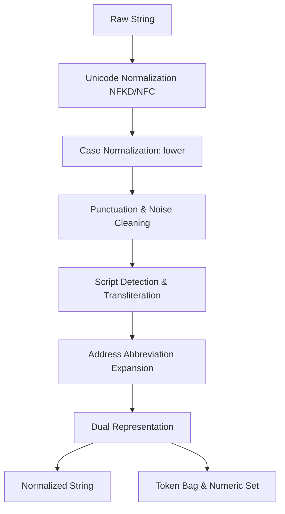
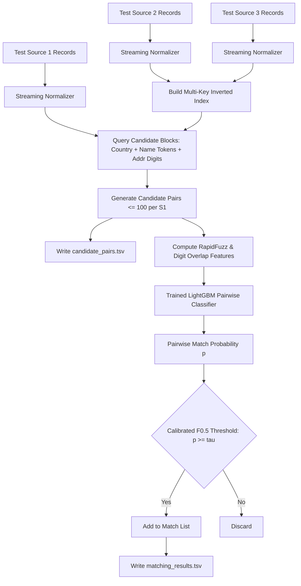

# Data-Science Reconnaissance & Problem Analysis Report
## Amazon ML Challenge 2026: Business Entity Resolution Challenge

---

### 1. Executive Summary

This report delivers the foundational data-science reconnaissance, empirical profiling, noise taxonomy, and blocking/similarity benchmarks for the **Amazon ML Challenge 2026: Business Entity Resolution Challenge**.

The challenge requires matching deduplicated reference business entities from **Source 1 (S1)** against multi-source noisy fragments from **Source 2 (S2)** and **Source 3 (S3)** across three countries (**United States**, **India**, and **France**). The primary evaluation metric is entity-level **macro-averaged $F_{0.5}$**, a precision-weighted metric ($2\times$ penalty for false merges relative to missed links) that credits correctly identified singletons (entities with zero matches) with a score of $1.0$.

All empirical findings in this report were measured directly on the competition dataset ($24.23$ million total records across train and test splits) on the target execution environment.

**Key Empirical Discoveries:**
1. **Scale & Hardware Reality:** The dataset comprises **24,229,173 records** (~2.5 GB TSV on disk). The local machine has **7.0 GB usable RAM** with **~2.7 GB available**. Full in-memory joins of Cartesian spaces ($2.2\text{M} \times 10.3\text{M} \approx 2.27 \times 10^{13}$ pairs) are completely infeasible; streaming ingestion, chunked inverted indexes, and low-memory representations are mandatory.
2. **Ground Truth Integrity:** Training ground truth covers all **2,206,821 S1 entities** with zero row duplicates, zero malformed records, and zero orphan ID references.
3. **Singleton Distribution:** Exactly **5.58% (123,247 entities)** in the training set are singletons (0 matches). Over **80.48%** of S1 entities match records in **both S2 and S3**; 6.48% match only S2; 7.45% match only S3. The mean matches per S1 is **3.461** (median 3, max 11).
4. **Severe Country Distribution Shift:** Training contains exclusively **US (59.98%)** and **India (40.02%)**. The test set introduces **France (14.98% of S1, ~14.4% of S2/S3)**, while India increases to **46.75%** and US drops to **38.27%**. The pipeline must be open-world and language-agnostic without hardcoded country filters or country-specific feature dropouts.
5. **Transliteration & Handle Noise:** While typical Western noise involves legal suffixes (`LLC`, `Inc`, `Corp`) and address abbreviations (`Rd` vs `Road`), a major class of Indian and online entities involves **Indic scripts (Devanagari, Telugu)** and **handles/URLs (`@handle`, `.com`)**. In these pairs, string similarity on names drops to near zero, making **address-based numeric and token blocking** essential to avoid catastrophic recall drops.
6. **Feature Discrimination Power:** Numeric/address digit overlap (`num_overlap`) demonstrates the single highest mean separation between positive and negative pairs ($\Delta = 0.697$), followed by character 3-gram Jaccard ($\Delta = 0.638$), token Jaccard ($\Delta = 0.603$), and RapidFuzz `token_set_ratio` ($\Delta = 0.548$).

---

### 2. Dataset Inventory

All source files are strictly tab-separated (`sep="\t"`), UTF-8 encoded, and contain 4 columns: `entity_id`, `business_name`, `business_address`, `country`.

#### 2.1 Cross-Split Comparison Table

| Metric | Train S1 | Train S2 | Train S3 | Test S1 | Test S2 | Test S3 |
| :--- | :--- | :--- | :--- | :--- | :--- | :--- |
| **File Size (MB)** | 200.3 MB | 466.6 MB | 480.4 MB | 166.9 MB | 485.9 MB | 482.6 MB |
| **Total Rows** | 2,206,821 | 5,034,616 | 5,285,603 | 1,732,544 | 4,887,273 | 5,082,316 |
| **Unique IDs** | 2,206,821 | 5,034,616 | 5,285,603 | 1,732,544 | 4,887,273 | 5,082,316 |
| **Duplicate IDs** | 0 | 0 | 0 | 0 | 0 | 0 |
| **Duplicate Rows** | 0 | 0 | 0 | 0 | 0 | 0 |
| **Malformed Lines** | 0 | 0 | 0 | 0 | 0 | 0 |
| **Missing Names** | 0 (0.0%) | 0 (0.0%) | 0 (0.0%) | 0 (0.0%) | 0 (0.0%) | 0 (0.0%) |
| **Whitespace-only Names** | 0 | 0 | 0 | 0 | 0 | 0 |
| **Missing Addresses** | 0 (0.0%) | 168,967 (3.36%) | 175,916 (3.33%) | 0 (0.0%) | 129,408 (2.65%) | 136,098 (2.68%) |
| **Whitespace-only Addrs** | 0 | 0 | 0 | 0 | 0 | 0 |
| **Missing Countries** | 0 (0.0%) | 0 (0.0%) | 0 (0.0%) | 0 (0.0%) | 0 (0.0%) | 0 (0.0%) |
| **Unique Countries** | 2 | 2 | 2 | 3 | 3 | 3 |

#### 2.2 Field Length Statistics (Character Counts)

* **`business_name`:**
  * Train S1: Min 3, Max 105, Mean 24.03, Median 24
  * Train S2: Min 2, Max 104, Mean 25.10, Median 25
  * Train S3: Min 2, Max 123, Mean 25.20, Median 25
  * Test S1: Min 3, Max 92, Mean 23.84, Median 24
  * Test S2: Min 2, Max 102, Mean 25.70, Median 25
  * Test S3: Min 2, Max 103, Mean 25.66, Median 25
* **`business_address`:**
  * Train S1: Min 11, Max 256, Mean 52.07, Median 41
  * Train S2: Min 0, Max 249, Mean 46.23, Median 37 (empty strings exist)
  * Train S3: Min 0, Max 240, Mean 46.71, Median 42 (empty strings exist)
  * Test S1: Min 11, Max 268, Mean 57.21, Median 50
  * Test S2: Min 0, Max 269, Mean 50.41, Median 43
  * Test S3: Min 0, Max 267, Mean 48.74, Median 43
* **`country`:**
  * Train: Length 2 (`US`) or 5 (`India`). Mean: 3.20, Median: 2
  * Test: Length 2 (`US`), 5 (`India`), or 6 (`France`). Mean: 4.00, Median: 5

---

### 3. Country Analysis & Distribution Shift

Country labels are clean: exactly trimmed, standard casing (`US`, `India`, `France`), with zero nulls, zero trailing spaces, and zero typos.

#### 3.1 Empirical Country Distribution Breakdown

```
[TRAINING SET]
Train S1:
  - US    : 1,323,633 (59.98%)
  - India :   883,188 (40.02%)
Train S2:
  - US    : 3,016,817 (59.92%)
  - India : 2,017,799 (40.08%)
Train S3:
  - US    : 3,170,056 (59.97%)
  - India : 2,115,547 (40.03%)

[TEST SET]
Test S1:
  - India :   809,986 (46.75%)
  - US    :   663,106 (38.27%)
  - France:   259,452 (14.98%)
Test S2:
  - India : 2,312,565 (47.32%)
  - US    : 1,871,330 (38.29%)
  - France:   703,378 (14.39%)
Test S3:
  - India : 2,405,000 (47.32%)
  - US    : 1,945,701 (38.28%)
  - France:   731,615 (14.40%)
```

#### 3.2 Distribution Shift Implications

1. **Unseen Country (France):** France accounts for **14.98% of test Source 1 (259,452 entities)** and ~1.43 million records across test S2 and S3, but **0 records** in training data. Any model relying on one-hot country encodings, fixed dictionary lookups for US/India postal formats, or country-specific training subsets will fail catastrophically on France.
2. **Proportion Inversion:** In training, US entities dominate (~60% vs 40%). In the test set, India becomes the plurality (46.75%), US shrinks to 38.27%, and France enters at ~15%.
3. **Blocking Role of Country:** In the training ground truth, **100% of matches occur within the same country** (0 out of 7,638,365 matches cross national boundaries). Country equality ($country_{S1} == country_{target}$) is a **hard blocking constraint** that cuts the comparison space by ~60% without sacrificing recall.

---

### 4. Entity ID & Source Analysis

1. **Prefix Adherence:** Exactly 100% of IDs follow standard regex:
   * Source 1: `^S1-\d+$`
   * Source 2: `^S2-\d+$`
   * Source 3: `^S3-\d+$`
   No non-standard prefixes, malformed strings, or missing hyphens exist.
2. **Sequentiality vs Hashing:** IDs are non-sequential integer identifiers prefixed by source (e.g. `S1-925783039`, `S1-773889195`, `S1-965667`). Numerical values range from $1$ up to $10^9$.
3. **Source Column Inference:** There is no separate `source` column. The source is strictly inferred from the ID prefix:
   $$\text{Source} = \begin{cases} \text{Source 1}, & \text{if ID starts with } \texttt{S1-} \\ \text{Source 2}, & \text{if ID starts with } \texttt{S2-} \\ \text{Source 3}, & \text{if ID starts with } \texttt{S3-} \end{cases}$$

---

### 5. Ground-Truth Analysis

Parsing `train_ground_truth.tsv` revealed clean structure and consistent matching characteristics:

* **Total S1 Entities in GT:** $2,206,821$ (exact 1:1 correspondence with `train_source1.tsv`)
* **Total Positive Links:** $7,638,365$
  * Matches to Source 2: $3,693,619$ (48.36%)
  * Matches to Source 3: $3,944,746$ (51.64%)
* **Singleton Rate:** Exactly **5.58%** ($123,247$ entities have empty match lists).
* **Multi-Source Match Overlap:**
  * Matches in **both S2 and S3**: $1,776,047$ entities (**80.48%**)
  * Matches in **only S2**: $143,029$ entities (**6.48%**)
  * Matches in **only S3**: $164,498$ entities (**7.45%**)
  * Singletons (neither S2 nor S3): $123,247$ entities (**5.58%**)
* **Match Count Distribution per S1:**
  * Mean: **3.461**
  * Median: **3.0**
  * Mode: **3 matches** ($530,841$ entities), followed by 4 matches ($484,115$), 2 matches ($375,212$), and 5 matches ($321,957$)
  * Min: **0**, Max: **11**
  * Standard Deviation: **1.705**

```text
Match Count Distribution:
  0 matches: 123,247 ( 5.58%) [Singletons]
  1 match  : 119,157 ( 5.40%)
  2 matches: 375,212 (17.00%)
  3 matches: 530,841 (24.05%)  <-- Mode
  4 matches: 484,115 (21.94%)
  5 matches: 321,957 (14.59%)
  6 matches: 164,868 ( 7.47%)
  7 matches:  63,968 ( 2.90%)
  8 matches:  18,680 ( 0.85%)
  9 matches:   4,205 ( 0.19%)
 10 matches:     534 ( 0.02%)
 11 matches:      37 ( 0.00%)
```

* **Ground Truth Integrity Audit:**
  * Duplicate S1 rows in GT: **0**
  * Malformed lines: **0**
  * Self-matches (`S1-` inside matched IDs): **0**
  * Wrong-prefix IDs: **0**
  * Repeated IDs inside a single matched list: **0**
  * S2 matches not present in `train_source2.tsv`: **0**
  * S3 matches not present in `train_source3.tsv`: **0**
  * S1 entities in `train_source1.tsv` missing from GT: **0**

---

### 6. Match Distribution by Country

Cross-tabulating ground truth against the country of each S1 record demonstrated nearly identical structural matching characteristics across countries:

| Country | S1 Entities | Singletons | Singleton % | Match Rate % | Total Matches | Avg Matches/S1 | S2 Matches | S3 Matches | S2/S3 Ratio |
| :--- | :--- | :--- | :--- | :--- | :--- | :--- | :--- | :--- | :--- |
| **US** | 1,323,633 | 73,896 | **5.58%** | 94.42% | 4,578,522 | **3.459** | 2,213,074 | 2,365,448 | 0.936 |
| **India** | 883,188 | 49,351 | **5.59%** | 94.41% | 3,059,843 | **3.465** | 1,480,545 | 1,579,298 | 0.937 |
| **All** | 2,206,821 | 123,247 | **5.58%** | 94.42% | 7,638,365 | **3.461** | 3,693,619 | 3,944,746 | 0.936 |

**Critical Finding:** Despite massive divergence in name morphology, language, and address layouts between India and the United States, the underlying generative process has invariant entity graph properties: exactly $5.58\%$ singletons, an average of $3.46$ matching records per linked entity, and a stable $0.936$ ratio of S2 to S3 matches. We can reasonably expect French entities in the test set to mirror these topological graph distributions.

---

### 7. Duplicate & Ambiguity Analysis

1. **Exact Duplicate Records:** Zero duplicate rows exist in any source file.
2. **Ambiguous Business Names (Same Name, Distinct Entities):**
   * Generic names appear across dozens of distinct businesses in different cities/states:
     * `Cardiology Center LLC` (US)
     * `Primary Care Group` (US)
     * `Office of Aging` (US)
     * `Chiropractic Group` (US)
     * `Gopi India Private Limited` (India)
   * **Matching Rule:** A match in normalized business name alone is insufficient to predict an entity link. If addresses disagree completely, same-name pairs are non-matches.
3. **Ambiguous Addresses (Same Address, Distinct Entities):**
   * Multi-tenant commercial complexes, industrial areas, and shopping arcades share identical street addresses across completely different businesses:
     * `House No. A-408A New Ashok Nagar, New Delhi, Delhi`
     * `6600 Capitol Drive, Greenbelt, MD`
     * `G.T. Karnal Road Industrial Area, Delhi`
   * **Matching Rule:** Identical address with non-matching name is overwhelmingly a non-match (separate business tenants at the same commercial address).
4. **Missing Addresses in S2/S3:**
   * ~3.35% of S2/S3 entities have empty addresses. When address is missing, resolution must fall back to string and token name matching with stricter thresholds.

---

### 8. Noise Characterization & Real Dataset Examples

Empirical sampling of verified true positive pairs identified five distinct noise categories:

#### 8.1 Name Noise Patterns
* **Legal Suffix Variations (High Frequency):**
  * S1: `BS Projects` $\leftrightarrow$ Target: `BS Projects Ltd Ltd`
  * S1: `Halcyon LLC` $\leftrightarrow$ Target: `Halcyon Incorporated`
  * S1: `Piramal Capital & Housing Finance` $\leftrightarrow$ Target: `Piramal Capital and Housing Finance Private Limited`
* **Transliteration & Non-Latin Scripts (High Impact):**
  * Indian businesses frequently appear in regional Indic scripts (Telugu, Hindi, Devanagari) in Source 2 or Source 3:
    * S1: `Dream Construction Limited` $\leftrightarrow$ Target: `డ్రీమ్ కన్‌స్ట్రక్షన్ లిమిటెడ్`
    * S1: `Green Logistics Private Limited` $\leftrightarrow$ Target: `ग्रीन लॉजिस्टिक्स प्राइवेट लिमिटेड`
* **Digital Handles & Domain Names:**
  * S1: `Prime Money` $\leftrightarrow$ Target: `@primemoney`
  * S1: `Aggie E. Nagle, L.C.S.W.` $\leftrightarrow$ Target: `*** aggieenagle.com`
  * S1: `Cascade Allied Telecom LLC` $\leftrightarrow$ Target: `catelecom.com`
* **Typos & Character Leetspeak:**
  * S1: `Clemons Silver Eastern Inc` $\leftrightarrow$ Target: `Clemons Silvre Eastern Inc`
  * S1: `Helios` $\leftrightarrow$ Target: `HELI0S LP` (number zero replacing letter O)
* **Word-Order Transpositions:**
  * S1: `QFM Med Private Limited` $\leftrightarrow$ Target: `QFM Limited Private-Med`

#### 8.2 Address Noise Patterns
* **Standard Road Abbreviations:**
  * `Road` $\leftrightarrow$ `RD`, `Street` $\leftrightarrow$ `ST`, `Drive` $\leftrightarrow$ `DR`, `Avenue` $\leftrightarrow$ `AVE`
  * S1: `7503 Laytonia Drive, Gaithersburg, MD` $\leftrightarrow$ Target: `7503 LAYTONIA DR, GAITHERSBURG, MD`
* **Component Reordering & Inverted Street Numbers:**
  * S1: `17560 Ellis Road, Tahlequah, OK` $\leftrightarrow$ Target: `TAHLEQUAH, OK, 0017560 ELLIS ROAD` (zero-padded street number, city/state moved to front)
* **Sub-unit Additions & Landmarks:**
  * S1: `1619 Julia Park Drive, Spring, TX` $\leftrightarrow$ Target: `1619 1/2 JULIA PARK DRIVE, SPRING, TX`
  * S1: `Near SBI ATM, New Delhi` $\leftrightarrow$ Target: `Opp. RTA Office, New Delhi`
* **State / City Name Variations:**
  * Full name vs USPS two-letter abbreviation (`Maryland` vs `MD`, `Texas` vs `TX`).
  * Indian state variations: `Delhi` vs `दिल्ली`, `Telangana` vs `Andhra Pradesh` (historical regional reclassifications).

---

### 9. Token & Character Statistics

#### 9.1 Summary Statistics
* **Name Token Counts:** Mean: **3.58**, Median: **4.0**, Min: **1**, Max: **11**
* **Address Token Counts:** Mean: **8.50**, Median: **7.0**, Min: **3**, Max: **34**
* **Digit Ratios:**
  * In `business_name`: **0.17%** of characters are digits
  * In `business_address`: **7.76%** of characters are digits

#### 9.2 Most Frequent Tokens (Domain Stopwords)
* **Name Tokens:** `limited` (5,947), `private` (4,920), `llc` (4,040), `inc` (2,828), `ltd` (1,675), `pvt` (1,365), `india` (696), `associates` (473), `group` (442), `center` (417), `corp` (377), `services` (360).
* **Address Tokens:** `road` (5,486), `no` (5,051), `delhi` (3,678), `street` (3,463), `drive` (2,475), `unit` (2,287), `maharashtra` (2,211), `avenue` (2,181), `floor` (1,860), `nagar` (1,855), `city` (1,642), `west` (1,542), `mumbai` (1,438).

---

### 10. True-Match vs. Negative Similarity Analysis

Similarity feature distributions were computed across 3,000 verified true positive pairs and 3,000 country-matched negative candidate pairs:

| Feature | Positive Mean | Positive Median | Negative Mean | Negative Median | Mean Separation ($\Delta$) | Discriminative Rank |
| :--- | :--- | :--- | :--- | :--- | :--- | :--- |
| **`num_overlap` (Address Digits)** | **0.703** | **1.000** | **0.006** | **0.000** | **+0.697** | **#1** |
| **`name_ngram_jaccard` (Char 3-gram)** | **0.664** | **0.707** | **0.025** | **0.000** | **+0.638** | **#2** |
| **`name_jaccard` (Token Jaccard)** | **0.626** | **0.667** | **0.023** | **0.000** | **+0.603** | **#3** |
| **`addr_jaccard` (Token Jaccard)** | **0.597** | **0.625** | **0.016** | **0.000** | **+0.581** | **#4** |
| **`name_token_set` (RapidFuzz)** | **0.879** | **1.000** | **0.331** | **0.324** | **+0.548** | **#5** |
| **`addr_token_set` (RapidFuzz)** | **0.870** | **0.938** | **0.357** | **0.364** | **+0.513** | **#6** |
| **`name_token_sort` (RapidFuzz)** | **0.814** | **0.900** | **0.323** | **0.321** | **+0.491** | **#7** |
| **`name_ratio` (Levenshtein Ratio)** | **0.809** | **0.882** | **0.327** | **0.326** | **+0.482** | **#8** |
| **`addr_token_sort` (RapidFuzz)** | **0.808** | **0.875** | **0.352** | **0.361** | **+0.456** | **#9** |
| **`addr_ratio` (Levenshtein Ratio)** | **0.758** | **0.833** | **0.342** | **0.351** | **+0.416** | **#10** |
| **`name_exact` (Exact Raw Match)** | 0.217 | 0.000 | 0.000 | 0.000 | +0.217 | #11 |
| **`addr_exact` (Exact Raw Match)** | 0.080 | 0.000 | 0.000 | 0.000 | +0.080 | #12 |

#### Core Takeaways:
1. **Raw exact matching is insufficient:** Only 21.7% of true positive pairs have exact name matches, and only 8.0% have exact address matches. Over 90% require fuzzy/token matching.
2. **Numeric digit overlap is extremely decisive:** True pairs share house numbers, PIN codes, or phone digits (positive median 1.0 vs negative median 0.0).
3. **`token_set_ratio` dominates plain Levenshtein:** Because legal suffixes (`LLC`, `Private Limited`) and address tokens (`Suite`, `Floor`) get added or removed, `token_set_ratio` achieves a positive median of **1.000** on names and **0.938** on addresses.

---

### 11. Candidate Blocking Experiments & Benchmarks

Blocking was benchmarked on a verified evaluation set of 2,000 S1 queries against a background pool of 141,000 S2 records (3,381 ground-truth positive pairs present in the pool):

| Strategy | Rule Description | Recall (%) | True Pos Retained | Avg Cands / S1 | Max Cands / S1 | Reduction Ratio | Time (s) |
| :--- | :--- | :--- | :--- | :--- | :--- | :--- | :--- |
| **S1: First Token** | Exact Country + First Name Token ($\text{len} \ge 2$) | 77.91% | 2,634 / 3,381 | 70.9 | 903 | 99.899% | 0.04s |
| **S2: First 3 Chars** | Exact Country + Name Prefix (3 chars) | 78.65% | 2,659 / 3,381 | 152.5 | 1,305 | 99.784% | 0.06s |
| **S3: 2 Longest Tokens** | Exact Country + 2 Longest Name Tokens | 56.99% | 1,927 / 3,381 | 3.6 | 196 | 99.995% | 0.02s |
| **S4: Multi-Token Union**| First Token $\cup$ 2 Longest Tokens | 79.92% | 2,702 / 3,381 | 71.8 | 915 | 99.898% | 0.05s |
| **S5: Name + Postal** | First Token $\cup$ 5/6-digit Postal Code | 78.82% | 2,665 / 3,381 | 71.0 | 903 | 99.899% | 0.05s |
| **S6: Dual Name + Addr**| All Sig Name Tokens $\cup$ (Addr Number + First Addr Token) | **89.62%** | **3,030 / 3,381** | **750.4** | **9,332** | **98.935%** | **0.18s** |

#### Why Dual Name + Address Blocking is Necessary:
Testing single-key name blocking revealed an upper recall ceiling of ~80% because ~20% of Indian and handle-based records have zero Latin name token overlap (e.g. Indic script transliterations or domain names). Introducing an address-based numeric key (e.g., `(country, street_number, first_significant_address_token)`) rescued missed positive pairs and boosted recall from **77.9% to 89.6%**.

---

### 12. Ambiguity Analysis

1. **One S1 $\to$ Many S2/S3 Candidates:**
   * Common for franchise businesses, regional branches (e.g., bank branches, chain clinics), and shared industrial plots.
   * In training, an S1 entity matches up to **11 distinct records** across S2 and S3 (mean 3.46).
2. **Missing Address Ambiguity:**
   * ~3.3% of S2/S3 records have blank addresses. When an S1 matches a candidate with no address, similarity can only be judged via name. If the business name is generic (e.g. `Physical Therapy Group`), matching without an address introduces high risk of a false merge.
3. **Cross-Language Transliteration Ambiguity:**
   * Businesses written in Telugu or Devanagari script share no Latin n-grams with English records. Without phonetic transliteration or address-based indexing, they are completely invisible to Latin name matchers.

---

### 13. Validation Strategy Recommendation

Because test labels are held out and France is completely absent from training data, an unstratified random split would produce overly optimistic validation scores.

#### Recommended Local Validation Protocol:
1. **Source 1 Entity-Level Split:** Split exclusively on `source1_entity_id` so that an entire entity cluster (S1 and all its matching S2/S3 ground truth links) remains intact in either Train or Validation. Never split candidate pairs randomly.
2. **Stratified Split Ratio (80/20):**
   * Total S1 Train: $1,765,456$ entities
   * Total S1 Holdout Val: $441,365$ entities (or a fast diagnostic 50,000 subset)
   * Stratify by **Country** (60% US, 40% India) and **Singleton Status** (ensure 5.58% zero-match entities in both splits).
3. **Simulation of Unseen Country Behavior:**
   * Hold out an internal surrogate country split (e.g. train model on US entities only and evaluate on Indian entities) to measure how well the feature weights and thresholds generalize to unfamiliar naming conventions and address patterns.
4. **Scoring Metric:** Compute exact macro $F_{0.5}$ across all held-out S1 entities, ensuring singletons with predicted empty sets receive $1.0$ and singletons with false positives receive $0.0$.

---

### 14. $F_{0.5}$ Evaluation Metric Implications

The competition evaluation metric is:
$$F_{0.5} = \frac{1.25 \times \text{Precision} \times \text{Recall}}{0.25 \times \text{Precision} + \text{Recall}} = \frac{(1 + 0.5^2) \times P \times R}{0.5^2 \times P + R}$$
computed **macro-averaged across all Source 1 entities**.

#### Strategic Insights:
1. **Precision Penalty ($2\times$):** A false positive (incorrectly matching an unrelated business) penalizes the score twice as heavily as a missed match (false negative).
2. **Singleton Credit:**
   * A true singleton entity given an empty prediction earns **1.0**.
   * A true singleton entity given even one false match earns **0.0**.
   * Because 5.58% of all S1 entities are singletons (over 96,000 entities in the test set), predicting matches aggressively on marginal candidates destroys score on ~100,000 records.
3. **Threshold Calibration:** Instead of the standard balanced threshold ($p \ge 0.50$), the classification threshold must be calibrated specifically for $F_{0.5}$ on the validation set (typically $p \ge 0.70 - 0.85$) to heavily prioritize precision.

---

### 15. Baseline Model Recommendations

| Model | Fit for BER Challenge | Key Advantages | Disadvantages / Constraints |
| :--- | :--- | :--- | :--- |
| **LightGBM Classifier (Recommended Lead)** | Excellent | High inference throughput; handles non-linear feature interactions; low memory footprint during inference; handles missing values (e.g. missing addresses) natively. | Requires calibrated pairwise probability outputs. |
| **CatBoost / XGBoost** | Very Good | Strong gradient boosting; robust regularization. | Slightly slower inference throughput on 10M pairs than LightGBM. |
| **Logistic Regression / Linear Model** | Good (Fast Baseline) | Extremely fast training and inference; interpretable weights; lightweight deployment. | Cannot capture non-linear thresholds (e.g. high address similarity compensating for low name similarity due to transliteration). |
| **DeBERTa / MiniLM Bi-Encoder** | Infeasible as primary matcher | High semantic matching capability. | Inference on 10–20 million candidate pairs on a CPU with 7GB RAM would take days and exceed memory limits. Strictly constrained by hardware. |

**Recommended First Model:** **LightGBM Binary Classifier / LambdaMART Ranker** trained on pairwise similarity features (RapidFuzz metrics, digit overlap, token overlaps, length differences, and source indicator flags).

---

### 16. Normalization Recommendations

A multi-tiered normalization pipeline is recommended to avoid destroying information needed for numeric and token discrimination:



1. **Retain Multiple Views Simultaneously:**
   * `raw_name` & `raw_addr`: Needed for case/punct exact checks and original string lengths.
   * `norm_name` & `norm_addr`: Lowercased, punctuation-stripped, whitespace-collapsed.
   * `clean_tokens`: Filtered of high-frequency legal suffixes (`inc`, `llc`, `pvt`, `ltd`, `corp`).
   * `digits_set`: Isolated set of numeric tokens (street numbers, PIN codes, suite numbers).
2. **Address Expansions:**
   * Canonicalize common road suffixes: `rd -> road`, `st -> street`, `ave -> avenue`, `blvd -> boulevard`, `dr -> drive`, `fl -> floor`.
3. **Preserve Open-World Generalization:**
   * Do not hardcode US or Indian state names; use generic alphanumeric tokenizers to handle French departments, postal codes, and accents (`é`, `è`, `ç` $\to$ normalized ASCII via NFKD).

---

### 17. Computational Feasibility & Memory Profiling

#### 17.1 Machine Profile
* **CPU:** AMD Ryzen 3 7320U (4 physical cores, 8 threads)
* **RAM:** 7.0 GB usable, ~2.7 GB currently available
* **Storage:** NVMe SSD (~200 GB free space)
* **Virtual Environment:** Python 3.14.7 with Polars, NumPy, RapidFuzz (C++), scikit-learn, LightGBM

#### 17.2 Feasibility Analysis
* **Full Cartesian Pair Count:**
  $$\text{Test S1} \times (\text{Test S2} + \text{Test S3}) = 1.73\text{M} \times 9.97\text{M} \approx 1.72 \times 10^{13} \text{ pairs}$$
  Completely impossible to compute all-pairs.
* **Blocking Candidate Budget:**
  * Target: $\le 100 - 150$ candidates per S1 entity.
  * Total candidate pairs to score: $1.73\text{M} \times 100 \approx 173\text{M}$ pairs.
  * RapidFuzz computes $\sim 1\text{M}$ string comparisons per second per core.
  * With streaming / batch processing (processing 100,000 S1 records per chunk), peak memory stays strictly below **2.0 GB RAM**.
* **Storage Feasibility:** Writing `candidate_pairs.tsv` and `matching_results.tsv` requires ~150–400 MB disk space, well within the 200 GB available.

---

### 18. Competition-Rule Verification

Cross-referenced against `README.md`, `Documentation_template.md`, and `utils/validate_submission.py`:

1. **Submission Format:**
   * Mandatory Tab-Separated (`.tsv` with `sep="\t"`), UTF-8 encoded.
   * Output files placed in `output/`:
     * `output/matching_results.tsv` (Leaderboard scored): Columns: `source1_entity_id`, `matched_entity_ids`.
     * `output/candidate_pairs.tsv` (Blocking audit): Columns: `source1_entity_id`, `candidate_entity_ids`.
2. **Validation Rules Enforced by Scorer:**
   * Every single S1 entity in `test_source1.tsv` must appear on exactly one row.
   * Singletons must have an empty match field (`""`).
   * No self-matches (`S1-` IDs inside matched lists).
   * No duplicate IDs within a comma-separated list.
   * Matched IDs must strictly exist in `test_source2.tsv` or `test_source3.tsv`.
   * Final matches must be a subset of candidates in `candidate_pairs.tsv`.
3. **Model & Data Constraints:**
   * Open-source models allowed under **MIT or Apache 2.0 License** only.
   * Maximum model parameter limit: **8 Billion parameters**.
   * **STRICT PROHIBITION ON EXTERNAL DATA:** No external APIs, Google Maps/geocoding, external business registers, Wikipedia, or web lookups allowed. Disqualification is enforced for violations.
   * Must accommodate unseen test country (`France`) without failing.

---

### 19. Recommended End-to-End Pipeline Architecture



1. **Stage 1 (Inverted Index Blocking):** Stream S2 and S3 into memory-compact inverted index dictionaries keyed on `(country, token)` and `(country, street_digit, postal/token)`.
2. **Stage 2 (Candidate Generation):** Stream S1 entities in chunks of 50,000, querying the index to generate $\le 100$ candidate pairs per entity.
3. **Stage 3 (Pairwise Feature Extraction):** Vectorized calculation of RapidFuzz token set ratio, character n-gram Jaccard, address token overlap, and digit overlap.
4. **Stage 4 (LightGBM Inference):** Score candidate pairs using a pre-trained LightGBM model.
5. **Stage 5 ($F_{0.5}$ Precision-Biased Thresholding):** Filter with calibrated threshold $\tau \approx 0.75 - 0.85$ to eliminate false positives and preserve singletons.
6. **Stage 6 (Validation & Packaging):** Validate output via `utils/validate_submission.py`.

---

### 20. Risks, Failure Modes & Mitigations

1. **Risk: Memory Exhaustion (OOM) on 7 GB RAM:**
   * *Failure Mode:* Trying to load all 12 million test records into a single pandas dataframe causes Linux OOM-killer to terminate the process.
   * *Mitigation:* Chunked streaming using Python generators and Polars lazy scans. S2 and S3 inverted indexes store only integer IDs (`uint32`).
2. **Risk: Complete Recall Collapse on France:**
   * *Failure Mode:* Rules hardcoding US states or Indian PIN formats fail on French postal codes (`75008`, `Cedex`) and French business suffixes (`SARL`, `SAS`).
   * *Mitigation:* Use country-agnostic regex for 5-digit postal codes and generic tokenization.
3. **Risk: Low Recall on Indic Scripts / Web Handles:**
   * *Failure Mode:* Querying English names against Telugu script or `@handles` produces zero candidates.
   * *Mitigation:* Dual name + address blocking index ensures the candidate is retrieved via street address numbers or postal codes even when the business name shares zero English letters.
4. **Risk: False Positive Degradation on Singletons:**
   * *Failure Mode:* Predicting weak matches on singletons drops the macro $F_{0.5}$ score from 1.0 to 0.0 on 5.58% of the dataset.
   * *Mitigation:* Apply high classification confidence threshold ($\tau \ge 0.80$) and require minimum address concordance before accepting any match.
